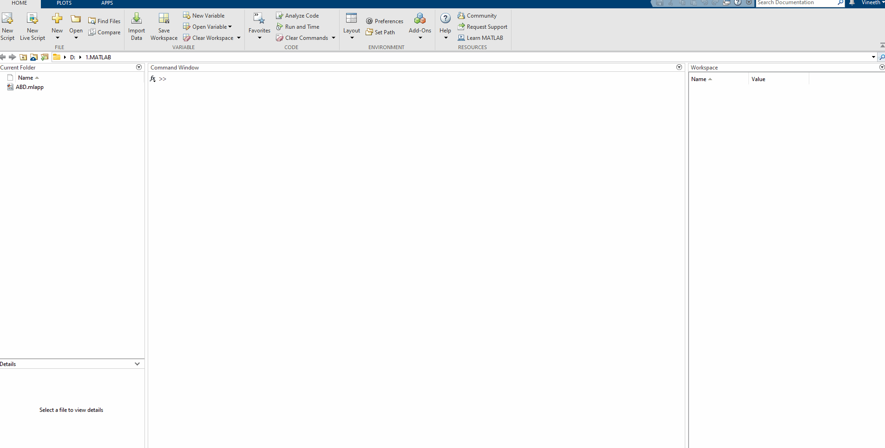
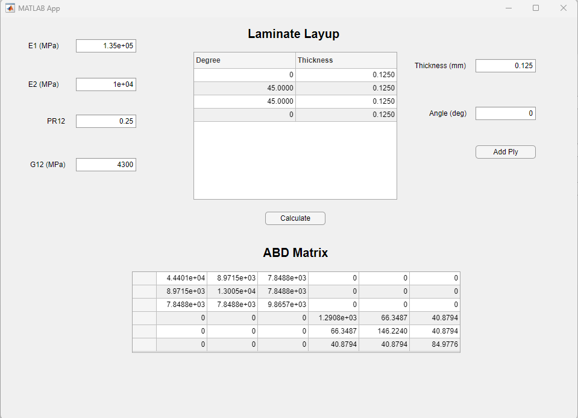
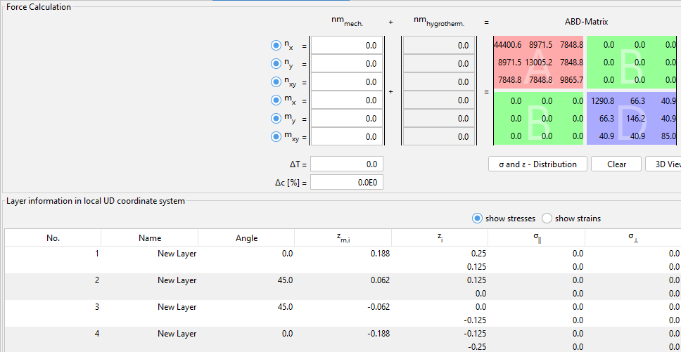

# ABD-Matrix-Laminate-Calculator

<em>ABD Matrix Calculator</em>

**ABD.mlapp** is an app that calculates the ABD matrix of a composite laminate. This app has been created using Matlab's app designer. The above gif shows the working of the app.

# Verification

The results from eLamX² are compared with the ABD.mlapp. A ply layup of [0°/45°/45°/0°] with each ply of 0.125 mm is used for the verification.

<em>ABD.mlapp Results</em>

<em>eLamX² Results</em>

The above images show the ABD matrix of eLamX² and ABD.mlapp, and the results match.
